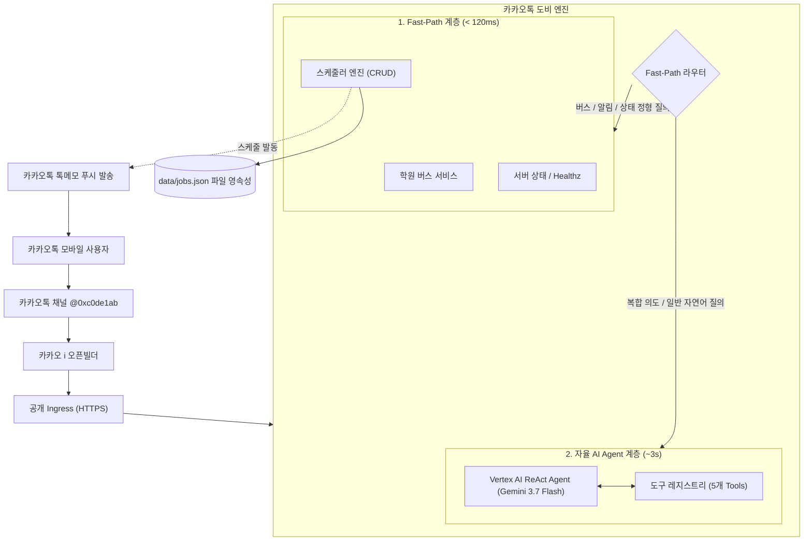

# 카카오톡 도비 (KakaoTalk Dobby) 🤖

[](https://goreportcard.com/report/github.com/dh-kam/kakaotalk-dobby)
[](https://opensource.org/licenses/MIT)

**카카오톡 도비(KakaoTalk Dobby)**는 **카카오 i 오픈빌더(Kakao i OpenBuilder)** 스킬 서버, **ReAct 기반 자율 AI 에이전트(Autonomous AI Agent)**, 그리고 **Cron & 타이머 스케줄러 엔진**이 통합된 프로덕션급 Go 언어 챗봇 백엔드입니다.

Google Vertex AI (`gemini-3.7-flash`), AWS Bedrock, OpenAI, Claude, DeepSeek, Ollama 등 다양한 LLM을 지원하며, 카카오톡 REST API를 통한 메시지 발송과 능동적인 푸시 알림을 제공합니다.

---

## 🌟 주요 기능

- **⚡ 초고속 Fast-Path & 자율 ReAct AI 에이전트 하이브리드 구조**:
  - **Fast-Path 라우팅**: 카카오 오픈빌더의 **5.0초 하드 타임아웃**을 방어하기 위해 버스 시간표 조회, 알림 관리, 상태 확인 등 정형 질의를 **120ms 미만**으로 즉시 응답.
  - **ReAct AI Agent**: Google Vertex AI (`gemini-3.7-flash`) 기반 다중 턴 추론 및 5종의 도구 자율 실행 (Function Calling).
- **⏰ 정밀 Cron & 푸시 알림 스케줄러 (`pkg/scheduler`)**:
  - 단발성 타이머(`once`: 예: *10분 뒤*, *내일 08:30*) 및 주기적 Cron 스케줄(`recurring`: 예: *매주 평일 15:00*) 완벽 지원.
  - **`Asia/Seoul` (KST)** 표준시 기준 동작 및 **원자적 파일 영속성 (`FileStore`)**을 통한 서버/파드 재부팅 시 스케줄 자동 복원.
  - 스케줄 트리거 시 카카오톡 나에게 보내기(톡메모 API)로 사용자에게 실시간 자동 푸시 발송.
  - 스케줄 생성(Create), 조회(Read), 수정(Update), 취소/삭제(Delete) **Full CRUD** 지원.
- **🚌 학원 셔틀버스 시간표 안내 엔진 (`pkg/academy`)**:
  - 다중 학원 셔틀 노선 및 승강장별 탑승 시각 데이터베이스 관리.
  - 카카오톡 네이티브 **`ItemCard`** UI 생성 및 기사님 전화 자동 연결 버튼 지원.
- **💬 카카오 REST API 풀 스택 SDK (`pkg/kakao`)**:
  - OAuth2 토큰 라이프사이클 관리 및 만료 시 자동 갱신(Auto-Refresh).
  - 톡메모(나에게 보내기), 친구 메시지 전송, 카카오 CDN 이미지 업로드/스크랩 관리.
- **☸️ 원클릭 Kubernetes & Ansible 배포 자동화 (`tools/manage.sh`)**:
  - ARM64 멀티아키텍처 도커 빌드, Oracle Cloud Registry (OCIR) 푸시, K8s Secret 동기화 및 롤아웃 재시작 자동화.

---

## 🏗️ 시스템 아키텍처



### 디렉토리 구조

```
.
├── cmd/
│   └── kakaobot/          # 애플리케이션 진입점 (main.go)
├── internal/
│   ├── bootstrap/         # Cobra CLI 커맨드 및 flagsbinder 바인딩
│   ├── config/            # Viper 및 .env 환경설정 로더
│   ├── buildinfo/         # Git 커밋 및 빌드 일시 메타데이터
│   └── usecase/
│       ├── skill/         # 오픈빌더 스킬 웹훅 서버 & Fast-Path 라우터
│       ├── webhook/       # 인바운드 웹훅 릴레이 서버
│       ├── agent/         # 터미널 자율 에이전트 실행 유스케이스
│       ├── auth/          # 카카오 OAuth2 인증 및 세션 검증
│       ├── send/          # 나에게 보내기 및 친구 메시지 발송
│       └── storage/       # 카카오 이미지 CDN 관리
├── pkg/
│   ├── scheduler/         # Cron & 타이머 스케줄러 엔진 (FileStore 영속성)
│   ├── agent/             # ReAct 추론 루프, Vertex AI & Bedrock 연동
│   ├── academy/           # 셔틀버스 시간표 파서 및 검색 엔진
│   ├── openbuilder/       # 카카오톡 네이티브 UI 빌더 (ItemCard, BasicCard 등)
│   ├── ai/                # LLM 프로바이더 추상화 (OpenAI, Gemini, Claude 등)
│   └── kakao/             # 카카오 REST API 클라이언트 및 도메인 서비스
├── data/
│   └── schedules/         # 셔틀버스 시간표 JSON 데이터베이스
└── tools/
    └── manage.sh          # 도커 빌드, OCIR 푸시 및 K8s 원클릭 배포 스크립트
```

---

## 🚀 빠른 시작

### 1. 사전 요구사항

- Go 1.23 이상
- Docker & Docker Buildx
- (선택) 카카오 디벨로퍼스 REST API 키 및 Client Secret
- (선택) Google Vertex AI API Key / GCP Project

### 2. 환경변수 설정

저장소 루트에 `.env` 파일을 생성합니다:

```bash
cp .env.example .env
```

```dotenv
# 카카오 디벨로퍼스 앱 인증 정보
KAKAO_REST_API_KEY=your_rest_api_key
KAKAO_CLIENT_SECRET=your_client_secret
KAKAO_REDIRECT_URI=http://localhost:8080/callback

# AI Provider 설정 (Vertex AI / Gemini)
AI_PROVIDER=gemini
VERTEX_PROJECT=your-gcp-project-id
VERTEX_LOCATION=global
VERTEX_API_KEY=your_gemini_or_vertex_api_key

# (선택) AWS Bedrock
AWS_REGION=us-east-1
AWS_BEARER_TOKEN_BEDROCK=your_bedrock_token
```

### 3. 로컬 빌드 및 실행

```bash
# 바이너리 빌드
make

# 카카오 오픈빌더 스킬 웹훅 서버 실행
./build/linux-amd64/debug/kakaobot skill serve --listen :8080
```

---

## 💬 카카오톡 지원 명령어 및 질의 예시

카카오톡 채널 **@0xc0de1ab** 또는 오픈빌더 스킬 테스트 화면에서 아래와 같이 입력할 수 있습니다:

| 분류 | 메시지 입력 예시 | 응답 형태 및 소요 시간 |
| :--- | :--- | :--- |
| **버스 시간표 조회** | `정상어학원 우미린2차 버스 몇 시에 와?` | 네이티브 `ItemCard` + 기사님 전화 연결 버튼 (~110ms) |
| **반복 Cron 알림 예약** | `매주 평일 오후 3시에 정상어학원 알림 등록해줘` | 월~금 15:00 Cron 알림 등록 완료 (~140ms) |
| **단발성 타이머 알림** | `10분 뒤에 라면 물 끄기 알림 등록해줘` | 10분 후 알림 예약 완료 (~105ms) |
| **예약 알림 목록 조회** | `알림 목록` 또는 `스케줄` | 현재 활성/완료된 스케줄 목록 카드 (~100ms) |
| **예약 알림 취소** | `알림 취소 job_1788189...` | 예약 작업 취소 완료 (~100ms) |
| **서버 상태 확인** | `상태` 또는 `서버 상태` | OS, Go버전, Goroutine, 메모리 카드 (~100ms) |
| **일반 AI 자연어 질의** | `양자컴퓨터의 원리를 한 문장으로 설명해줘` | Vertex AI Gemini 3.7 Flash 답변 (~3s) |

---

## 🛠️ CLI 사용법 가이드

카카오톡 도비는 서버 실행 외에도 터미널 환경에서 다양한 관리 명령어를 지원합니다:

```bash
# 오픈빌더 스킬 서버 실행
kakaobot skill serve --listen :8080 --channel-id 0xc0de1ab

# CLI에서 자율 ReAct 에이전트 직접 실행
kakaobot agent run "우미린 2차 3시 40분 수업 버스 시간 찾아서 알려줘"

# 카카오 OAuth2 로그인 및 토큰 유효성 검사
kakaobot auth login
kakaobot auth check

# 나에게 카카오톡 메시지 전송 (톡메모)
kakaobot send me --text "도비가 보낸 테스트 메시지입니다!"

# 인바운드 웹훅 릴레이 서버 실행
kakaobot serve --listen :8080 --secret-token my-secret
```

---

## 🐳 Docker 및 Kubernetes 배포

`./tools/manage.sh` 스크립트를 통해 원클릭으로 빌드 및 클러스터 배포가 가능합니다:

```bash
# Oracle Cloud Registry (OCIR) 로그인
./tools/manage.sh login

# 원클릭 배포: ARM64 이미지 빌드 -> OCIR 푸시 -> Ansible을 통한 K8s Secret 동기화 & 롤아웃 재시작
./tools/manage.sh deploy
```

배포 파이프라인 진행 과정:
1. `linux/arm64` 대상 Go 정적 바이너리 빌드.
2. 초경량 Alpine 컨테이너(Non-root 보안 계정) 패키징.
3. `icn.ocir.io/<namespace>/kakaotalk-dobby:<tag>` 이미지 푸시.
4. Ansible 플레이북 실행으로 K8s Secret 갱신 및 Deployment 롤아웃 재시작.
5. 공개 HTTPS 엔드포인트 `/healthz` 상태 검증 (`200 OK`).

---

## 🧪 테스트 실행

전체 패키지 및 단위 테스트를 수행합니다:

```bash
# 전체 테스트 실행
go test -v ./...

# 스케줄러 파일 영속성 및 타이머 테스트
go test -v ./pkg/scheduler/...

# ReAct 에이전트 추론 루프 및 Tool 호출 테스트
go test -v ./pkg/agent/...
```

---

## 📄 라이선스 (License)

이 프로젝트는 [MIT 라이선스](LICENSE)를 따릅니다.
