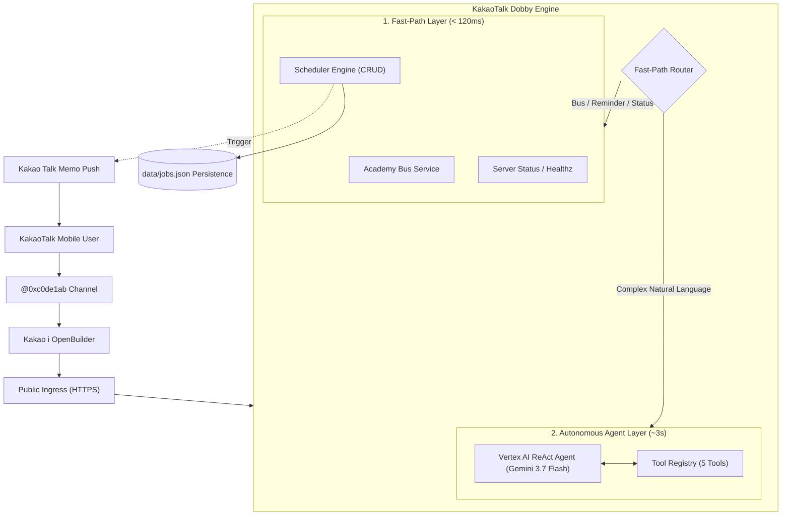

# KakaoTalk Dobby (카카오톡 도비) 🤖

[](https://goreportcard.com/report/github.com/dh-kam/kakaotalk-dobby)
[](https://opensource.org/licenses/MIT)

**KakaoTalk Dobby** is an intelligent, production-grade KakaoTalk AI Chatbot Skill Server, Autonomous ReAct Agent, and Cron Scheduler engine built in Go. It connects with **Kakao i OpenBuilder**, **Kakao REST APIs**, and multi-provider LLMs (Google Vertex AI / Gemini 3.7 Flash, AWS Bedrock, OpenAI, Anthropic Claude, Ollama, DeepSeek).

---

## 🌟 Key Features

- **⚡ Sub-120ms Fast-Path & Autonomous AI Agent**:
  - **Fast-Path Routing**: Instantly resolves bus schedule lookups, schedule management, and health checks in < 120ms to safely bypass Kakao OpenBuilder's 5.0-second hard cutoff.
  - **ReAct AI Agent**: Powered by Google Vertex AI (`gemini-3.7-flash`) and AWS Bedrock with autonomous multi-turn reasoning and tool calling.
- **⏰ Precision Cron & Reminder Scheduler (`pkg/scheduler`)**:
  - Full **CRUD** support for one-shot timers (`once`) and recurring cron jobs (`recurring`).
  - Native **`Asia/Seoul` (KST)** timezone support with atomic JSON file persistence (`FileStore`) across pod restarts.
  - Automatic proactive push notifications to KakaoTalk via Talk Memo API (`SendToMe`).
- **🚌 Academy Shuttle Bus Schedule Engine (`pkg/academy`)**:
  - Structured route and stop management for multi-academy shuttle networks.
  - Generates native KakaoTalk **`ItemCard`** UI with stop times and click-to-call mobile dialer buttons.
- **💬 Full Kakao REST API SDK (`pkg/kakao`)**:
  - OAuth2 token lifecycle management with automatic refresh.
  - Talk Memo (`/v2/api/talk/memo/*`) and Friend messaging (`/v1/api/talk/friends/*`).
  - Kakao CDN image upload, scrape, and lifecycle management.
- **☸️ One-Click Kubernetes & Ansible Deployment (`tools/manage.sh`)**:
  - Automated ARM64 Docker build, Oracle Cloud Infrastructure Registry (OCIR) push, K8s secret synchronization, and rollout verification.

---

## 🏗️ Architecture



### Package Layout

```
.
├── cmd/
│   └── kakaobot/          # Application entrypoint
├── internal/
│   ├── bootstrap/         # Cobra CLI commands & flagsbinder wiring
│   ├── config/            # Viper & .env configuration loader
│   ├── buildinfo/         # Git commit & build timestamp metadata
│   └── usecase/
│       ├── skill/         # OpenBuilder skill server & Fast-Path router
│       ├── webhook/       # Inbound webhook relay server
│       ├── agent/         # CLI autonomous agent execution
│       ├── auth/          # OAuth2 login and token check usecases
│       ├── send/          # Talk memo & friend message dispatchers
│       └── storage/       # Kakao image CDN management
├── pkg/
│   ├── scheduler/         # Cron & timer engine with FileStore persistence
│   ├── agent/             # ReAct reasoning loop, Vertex AI & Bedrock providers
│   ├── academy/           # Shuttle bus timetable parser & search service
│   ├── openbuilder/       # Fluent KakaoTalk UI builders (ItemCard, BasicCard)
│   ├── ai/                # LLM client abstractions (OpenAI, Gemini, Claude)
│   └── kakao/             # Core Kakao REST API client and domain services
├── data/
│   └── schedules/         # JSON timetable database
└── tools/
    └── manage.sh          # One-click Docker & K8s deployment script
```

---

## 🚀 Quick Start

### 1. Prerequisites

- Go 1.23+
- Docker & Docker Buildx
- (Optional) Kakao Developer App REST API Key & Client Secret
- (Optional) Google Vertex AI API Key / GCP Project

### 2. Configuration

Create `.env` in the repository root:

```bash
cp .env.example .env
```

```dotenv
# Kakao Developer Credentials
KAKAO_REST_API_KEY=your_rest_api_key
KAKAO_CLIENT_SECRET=your_client_secret
KAKAO_REDIRECT_URI=http://localhost:8080/callback

# AI Provider Settings (Vertex AI / Gemini)
AI_PROVIDER=gemini
VERTEX_PROJECT=your-gcp-project-id
VERTEX_LOCATION=global
VERTEX_API_KEY=your_gemini_or_vertex_api_key

# (Optional) AWS Bedrock
AWS_REGION=us-east-1
AWS_BEARER_TOKEN_BEDROCK=your_bedrock_token
```

### 3. Build & Run Locally

```bash
# Build the binary
make

# Run the OpenBuilder Chatbot Skill Webhook Server
./build/linux-amd64/debug/kakaobot skill serve --listen :8080
```

---

## 💬 Chatbot Interactions & Supported Commands

Users can interact naturally in KakaoTalk with both fast-path and LLM-driven queries:

| Category | Example Utterance | Response Type & Latency |
| :--- | :--- | :--- |
| **Bus Schedule** | `정상어학원 우미린2차 버스 몇 시에 와?` | Native `ItemCard` + Call Driver Button (~110ms) |
| **Recurring Cron** | `매주 평일 오후 3시에 정상어학원 알림 등록해줘` | Cron Schedule Confirmation (~140ms) |
| **One-Shot Reminder** | `10분 뒤에 라면 물 끄기 알림 등록해줘` | Timer Schedule Confirmation (~105ms) |
| **List Schedules** | `알림 목록` 또는 `스케줄` | List of active/completed jobs (~100ms) |
| **Cancel Schedule** | `알림 취소 job_1788189...` | Cancellation confirmation (~100ms) |
| **Server Status** | `상태` 또는 `서버 상태` | System memory & goroutine card (~100ms) |
| **General AI Chat** | `양자컴퓨터의 원리를 한 문장으로 설명해줘` | Vertex AI Gemini 3.7 Flash response (~3s) |

---

## 🛠️ CLI Reference

KakaoTalk Dobby provides a full suite of CLI tools for maintenance and automation:

```bash
# Start OpenBuilder skill webhook server
kakaobot skill serve --listen :8080 --channel-id 0xc0de1ab

# Execute Autonomous ReAct Agent from terminal
kakaobot agent run "우미린 2차 3시 40분 수업 버스 시간 찾아서 알려줘"

# Authenticate with Kakao OAuth2
kakaobot auth login
kakaobot auth check

# Send Kakao Talk Memo to self
kakaobot send me --text "Hello from Dobby!"

# Run Inbound Webhook Relay Server
kakaobot serve --listen :8080 --secret-token my-secret
```

---

## 🐳 Docker & Kubernetes Deployment

Deploy to Kubernetes with a single command via `./tools/manage.sh`:

```bash
# Authenticate to Oracle Cloud Registry (OCIR)
./tools/manage.sh login

# One-Click: Build ARM64 Docker image, push to OCIR, and deploy to K8s via Ansible
./tools/manage.sh deploy
```

The deployment automatically:
1. Cross-compiles the Go binary for `linux/arm64`.
2. Packages a minimal Alpine container with non-root security context.
3. Pushes image to `icn.ocir.io/<namespace>/kakaotalk-dobby:<tag>`.
4. Executes Ansible playbook to sync `.env` K8s secrets and perform `kubectl rollout restart`.
5. Validates live HTTPS endpoint healthz (`200 OK`).

---

## 🧪 Testing

Run comprehensive unit and integration tests across all packages:

```bash
# Run all tests
go test -v ./...

# Run scheduler persistence & lifecycle tests
go test -v ./pkg/scheduler/...

# Run agent ReAct loop & tool calling tests
go test -v ./pkg/agent/...
```

---

## 📄 License

This project is licensed under the [MIT License](LICENSE).
